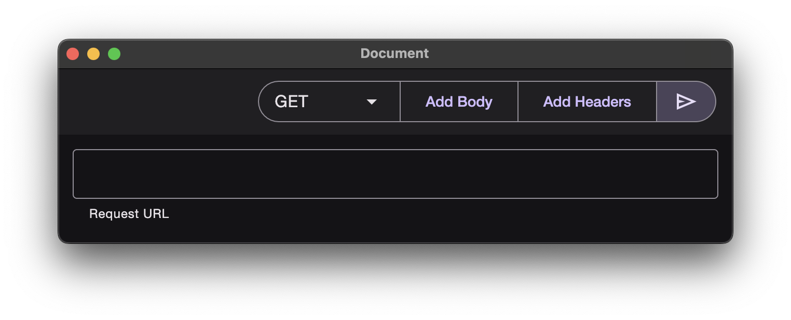

# Electron HTTP client



## Instructions

Replace `yarn` with `npm` if you use npm

### How to run

```sh
yarn dev
```

### How to build

```sh
# Windows
yarn electron-packager . http-client --platform=win32 --arch=x64 # for 64-bit CPUs
yarn electron-packager . http-client --platform=win32 --arch=x86 # for 32-bit CPUs
yarn electron-packager . http-client --platform=win32 --arch=arm64 # for ARM

# MacOS
yarn electron-packager . http-client --platform=darwin --arch=arm64 # for apple M chips
yarn electron-packager . http-client --platform=darwin --arch=x64 # for older (intel) macs

# Linux
yarn electron-packager . http-client --platform=linux --arch=x64 # for 64-bit CPUs
yarn electron-packager . http-client --platform=linux --arch=x86 # for 32-bit CPUs
yarn electron-packager . http-client --platform=linux --arch=arm64 # for ARM
```
